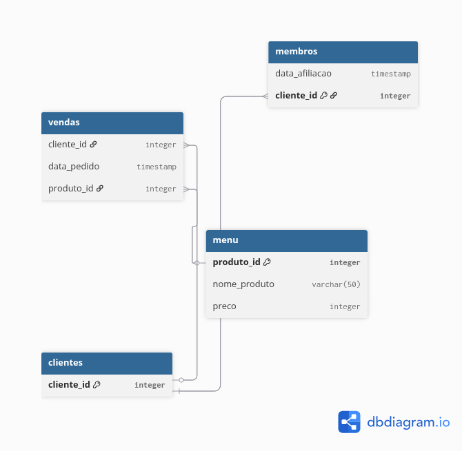

🔵 Introdução

Um cliente abriu um restaurante japonês em 2025 chamado Danny's Dinner e, ao longo desse período, coletou alguns dados básicos sobre sua operação. No entanto, ele ainda não sabe como utilizá-los de forma estratégica para impulsionar o crescimento ou garantir a sustentabilidade do negócio.

🔵 Problema

O cliente deseja utilizar dados operacionais para entender melhor o comportamento dos clientes, incluindo padrões de visita, valor gasto e preferências de consumo. Com esses insights, ele busca melhorar a experiência dos clientes e avaliar a expansão do programa de fidelidade.

Devido a restrições de privacidade, foi disponibilizada apenas uma amostra dos dados, composta por três conjuntos principais:

🔹vendas (sales)  
🔹cardápio (menu)  
🔹clientes membros (members)  

Além disso, há a necessidade de gerar datasets simplificados para que a equipe possa analisar as informações sem depender de consultas SQL.

## Modelo de Dados

O projeto é baseado em três tabelas principais:

🔹 vendas: registros de compras realizadas pelos clientes
🔹 menu: informações dos produtos disponíveis
🔹 membros: clientes que aderiram ao programa de fidelidade

A tabela 'vendas' se relaciona com 'menu' através do 'produto_id' e com 'membros' através do 'cliente_id'.

